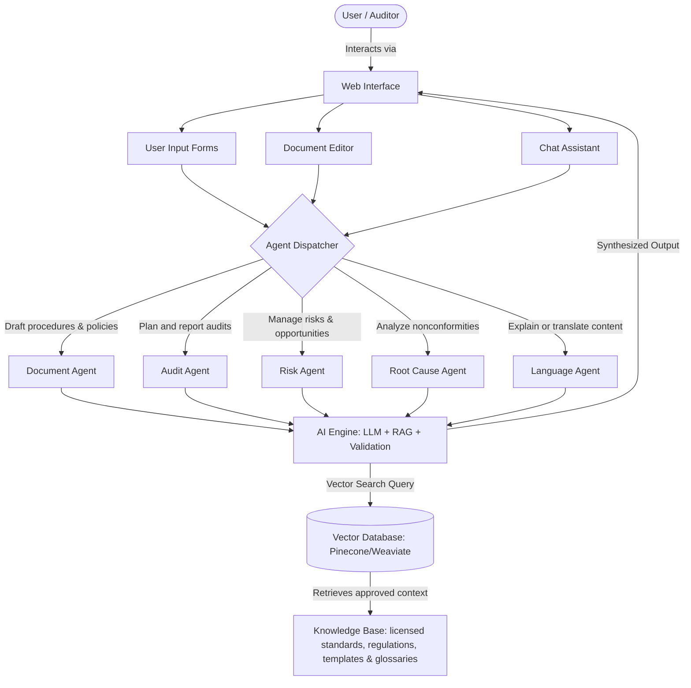

# Denhe reRuzivo AI
### Intelligent Quality Management Copilot

Denhe reRuzivo AI is a Quality Management Institute of Zimbabwe (QMIZ) concept-stage platform that makes quality-management expertise more accessible to Zimbabwean organisations. It combines large language models (LLMs), retrieval-augmented generation (RAG), curated and licensed quality knowledge, and human review to support the full management-system lifecycle.

The copilot helps users develop procedures, policies and manuals; interpret ISO requirements; build risk and opportunity registers; plan and report audits; record nonconformities; perform root-cause analysis; manage corrective actions; and translate approved quality content into plain English, Shona and Ndebele. It supports ISO 9001, ISO 14001, ISO 22000, ISO 45001, ISO 27001, ISO 31000, ISO 19011, ISO/IEC 17025 and ISO 15189 use cases.

---

## 📂 Submission Documentation Suite

This repository contains the full set of technical deliverables required for the **AI for Impact (AI4I) Challenge** Concept Stage submission:

* **[Technical proposal](./fullsubmission.txt)**: QMIZ's AI for Impact Challenge proposal and national-impact case.
* **[Technical Evidence Pack](./technical_evidence.md)**: Direct evidence and answers for the AI4I readiness requirements.
* **[Annex A: Business Model & Sustainability Plan](./business_model.md)**: Customer, funding, operating-cost and sustainability assumptions.
* **[User Journey Map](./user_journey.md)**: Journeys for SMEs, auditors and accreditation-ready laboratories.
* **[Detailed Architecture Document](./architecture.md)**: RAG, multilingual, validation and data-flow design.
* **[Annex D: Technical Architecture Specifications](./annex_d.md)**: Proposed technology stack, data stores and integrations.
* **[Annex B: Deployment & Operational Plan](./deployment_plan.md)**: QMIZ-led pilot, support and 30/60/90-day rollout.
* **[Security, Privacy & Responsible AI Safeguards](./security_plan.md)**: Access control, data protection and human-validation controls.
* **[Data Sources, Rights, Limitations and Quality](./data_governance.md)**: Source governance, content rights and data-quality controls.

---

## 🚀 How the System Works

The platform functions as a copilot for quality managers, auditors, laboratory personnel, consultants and operational teams. It reduces the cost and effort of implementing management systems while preserving professional accountability: all generated material remains a reviewable draft, not certification or legal advice.

### The Step-by-Step Workflow

1. **User Request**: The user selects a task, standard, organisational context and preferred language—for example, a risk register, an audit checklist or a procedure draft.
2. **Agent Assignment**: The request is routed to the appropriate specialist workflow, such as document drafting, audit, risk, root-cause analysis or translation.
3. **Retrieval-Augmented Generation (RAG)**:
   * The AI Engine searches an authorised knowledge base for relevant standard excerpts, regulatory guidance, approved templates and organisational material the user is allowed to access.
   * Each response displays the source context and flags insufficient evidence rather than inventing a requirement.
4. **Context-Aware Synthesis**: The LLM produces a structured draft, explanation or translation that preserves technical meaning and separates recommendations from verified requirements.
5. **Human-in-the-Loop Review**: A qualified user validates, edits and approves the result before publication, implementation or use in an audit.
