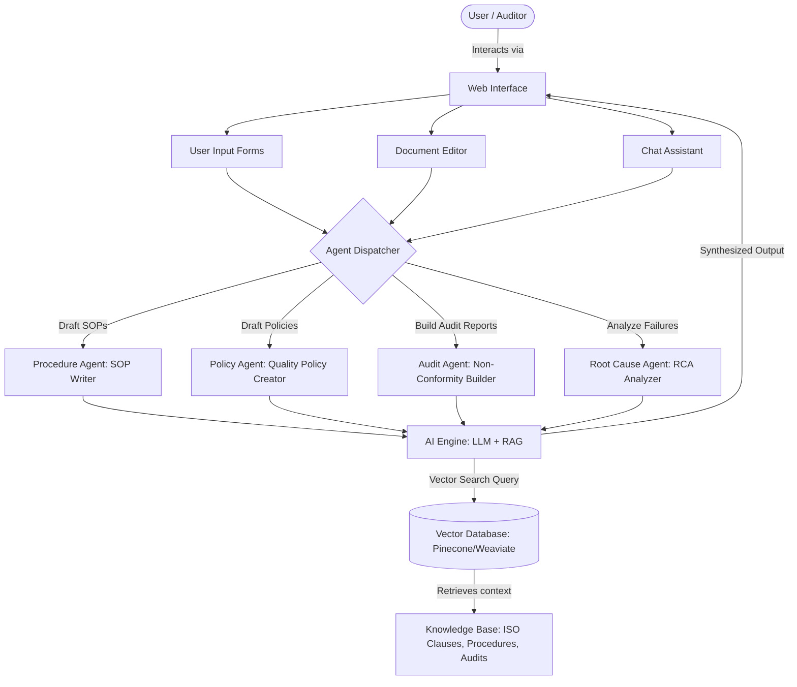

# AI-Based Quality Management System (QMS)
### Research and Practitioner Assistant

An intelligent, agentic compliance and Quality Management System designed to assist organizations in aligning with international standards (such as ISO 9001 and ISO 14001). This tool automates the tedious processes of drafting Standard Operating Procedures (SOPs), creating quality policies, structuring non-conformity reports, and conducting root cause analyses (RCA) using a Retrieval-Augmented Generation (RAG) architecture.

---

## 📂 Submission Documentation Suite

This repository contains the full set of technical deliverables required for the **AI for Impact (AI4I) Challenge** Concept Stage submission:

* **[Annex A: Business Model & Sustainability Plan](./business_model.md)**: Highlights customer/payer logic, cost assumptions, and long-term sustainability models.
* **[User Journey Map](./user_journey.md)**: Details target user personas (Tendai and Ruvimbo) and maps step-by-step user interaction paths.
* **[Detailed Architecture Document](./architecture.md)**: Explains the RAG data flow, sequence of events, and agent-dispatch mechanism.
* **[Annex D: Backend Architecture Specifications](./annex_d.md)**: Outlines the chosen technology stack, database layouts, and integration channels.
* **[Annex B: Deployment & Operational Plan](./deployment_plan.md)**: Highlights local Zimbabwean hosting plans, connectivity optimizations (offline support), and 30/60/90-day milestones.
* **[Security, Privacy & Responsible AI Safeguards](./security_plan.md)**: Documents the system role permissions, database encryption, and human-in-the-loop validation gates.

---

## 🚀 How the System Works

The platform functions as a co-pilot for Quality Managers and Auditors. Instead of starting compliance documentation from scratch or manually navigating dense regulatory frameworks, users interact with specialized AI agents powered by real-time standard databases.

### The Step-by-Step Workflow

1. **User Request**: The user specifies a task in the **Web Interface** (e.g., submitting audit notes via a form, or asking a compliance question in the chat).
2. **Agent Assignment**: The request is routed to the appropriate specialized compliance agent (e.g., the *Audit Agent* if dealing with non-conformities, or the *Procedure Agent* if drafting an SOP).
3. **Retrieval-Augmented Generation (RAG)**:
   * The AI Engine formulates a query and searches the **Vector Database (Pinecone/Weaviate)** for semantically relevant regulatory clauses, approved templates, and historical data.
   * Relevant **ISO Clauses** and standards are retrieved from the knowledge base.
4. **Context-Aware Synthesis**: The LLM combines the user's specific context with the retrieved standard clauses and templates, generating a precise, compliant draft.
5. **Human-in-the-Loop Review**: The draft is pushed directly into the **Document Editor** for human validation, editing, and approval before being finalized.
