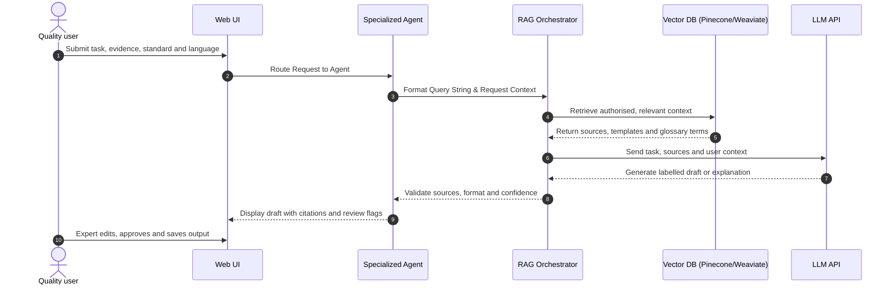

# Denhe reRuzivo AI: Architecture
### Intelligent Quality Management Copilot

This concept-stage architecture describes how QMIZ can deliver a secure, multilingual quality-management copilot for Zimbabwe's National Quality Infrastructure. It is designed to support ISO implementation, certification readiness and accreditation preparation; it does not replace competent auditors, consultants, certification bodies or official standards.

---

## 🏗️ System Components

The system is split into four distinct layers:

```
┌─────────────────────────────────────────────────────────┐
│                     Web Interface                       │
│      (User Input Forms, Document Editor, Chat)          │
└────────────────────────────┬────────────────────────────┘
                             │
                             ▼
┌─────────────────────────────────────────────────────────┐
│                   Agentic Control Layer                 │
│ (Document, Audit, Risk, RCA & Language workflows)       │
└────────────────────────────┬────────────────────────────┘
                             │
                             ▼
┌─────────────────────────────────────────────────────────┐
│                       AI Engine                         │
│       (LLM, RAG Routing, Prompt/Reasoning Layer)        │
└─────────────────────────────┬───────────────────────────┘
                              │
                              ▼
┌─────────────────────────────────────────────────────────┐
│                    Data & Storage                       │
│ (Vector DB, authorised knowledge, QMS, CAPA & risk DB) │
└─────────────────────────────────────────────────────────┘
```

### 1. Web Interface (Presentation Layer)
* **User Input Forms**: Capture the task, applicable standard, organisation context, evidence and preferred language. Validation separates observations, requirements and assumptions.
* **Document Editor**: Lets authorised users create, compare, revise, approve and export procedures, policies, manuals, audit reports and training materials.
* **Copilot Chat**: Provides grounded explanations of retrieved content in plain English, Shona or Ndebele, with source references and clear uncertainty notices.

### 2. Agentic Control Layer
This layer consists of specialized, prompt-engineered agents that run custom instructions:
* **Document Workflow**: Produces structured procedure, policy, manual and work-instruction drafts from approved templates.
* **Audit Workflow**: Builds audit programmes and checklists, structures evidence and records technically clear nonconformities.
* **Risk Workflow**: Develops risk-and-opportunity registers aligned with the selected management system and ISO 31000 principles.
* **Root-Cause Workflow**: Guides 5 Whys, Ishikawa/Fishbone and corrective-action analysis without treating suggestions as findings.
* **Language Workflow**: Explains and translates approved material into Shona, Ndebele or plain English. A bilingual reviewer verifies technical meaning before release.

### 3. AI Engine (Retrieval & Generation Layer)
* **LLM API Wrapper**: Integrates selected model endpoints behind a provider-neutral interface and keeps prompts, evaluations and access controls auditable.
* **RAG Orchestrator**: Embeds a request, filters retrieval by document rights, standard, jurisdiction, organisation and language, and injects only relevant authorised context into the model.
* **Validation Layer**: Checks required fields, source coverage, output format and prohibited claims. Low-confidence or unsupported results are returned for expert review, not presented as verified compliance advice.

### 4. Vector Database & Knowledge Stores (Storage Layer)
* **Vector DB**: Pinecone or Weaviate, hosting rights-controlled indexes of licensed standard excerpts, regulations, guidance, templates and quality glossaries. Full ISO texts are ingested only with permission from the rightsholder.
* **Relational DB**: PostgreSQL storing user accounts, tenant configuration, approvals, audit trails, corrective actions, risk registers and accreditation-readiness artefacts.
* **Object Store and Template Library**: Encrypted source documents and approved, versioned templates for ISO 9001, 14001, 22000, 45001, 27001, 31000, 19011, ISO/IEC 17025 and ISO 15189 use cases.

---

## 🔄 RAG Data Flow


