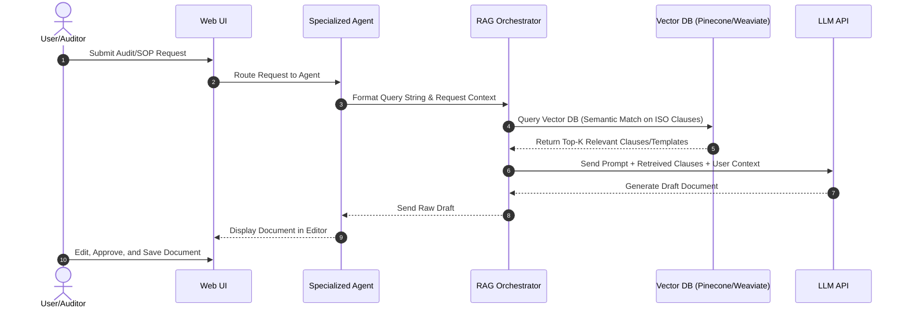

# Detailed AI Architecture Document
### AI-Based QMS Research & Practitioner Assistant

This document outlines the detailed architecture and technical integration pathways for the QMS assistant, expanding upon the AI architecture diagram.

---

## 🏗️ System Components

The system is split into four distinct layers:

```
┌─────────────────────────────────────────────────────────┐
│                     Web Interface                       │
│      (User Input Forms, Document Editor, Chat)          │
└────────────────────────────┬────────────────────────────┘
                             │
                             ▼
┌─────────────────────────────────────────────────────────┐
│                   Agentic Control Layer                 │
│   (Procedure, Policy, Audit, & Root Cause Agents)       │
└────────────────────────────┬────────────────────────────┘
                             │
                             ▼
┌─────────────────────────────────────────────────────────┐
│                       AI Engine                         │
│       (LLM, RAG Routing, Prompt/Reasoning Layer)        │
└─────────────────────────────┬───────────────────────────┘
                              │
                              ▼
┌─────────────────────────────────────────────────────────┐
│                    Data & Storage                       │
│    (Vector DB, Knowledge Base, Standards DB, CAPA DB)   │
└─────────────────────────────────────────────────────────┘
```

### 1. Web Interface (Presentation Layer)
* **User Input Forms**: Capture data from the user. Form validations map input fields to agent expectations (e.g., separating raw observations from standard references).
* **Document Editor**: Real-time rich text editor integrated with the Agent Control Layer. It allows users to write prompts directly or request sections of the active document to be expanded, rephrased, or checked against standards.
* **Chat Assistant**: A lightweight chat UI designed for swift QA queries against the vector-indexed standards.

### 2. Agentic Control Layer
This layer consists of specialized, prompt-engineered agents that run custom instructions:
* **Procedure Agent**: SOP specialized template parser.
* **Policy Agent**: Policy template builder.
* **Audit Agent**: Maps raw logs to compliance checklists.
* **Root Cause Agent**: Guided prompt framework implementing standard RCA mechanisms (e.g., 5-Whys, Ishikawa/Fishbone reasoning).

### 3. AI Engine (Retrieval & Generation Layer)
* **LLM API Wrapper**: Integrates model endpoints (e.g., Claude/Gemini).
* **RAG Orchestrator**: Converts queries into vector embeddings using standard models (e.g., `text-embedding-3-small`), searches the Vector DB, retrieves the top-$K$ matching documents, and injects them into the model's context window.

### 4. Vector Database & Knowledge Stores (Storage Layer)
* **Vector DB**: Pinecone or Weaviate, hosting the **ISO Clause Index** and **Audit Examples**.
* **Relational DB**: PostgreSQL storing user accounts, system configuration, session logs, and the **Corrective Action (CAPA) Database**.
* **Template Library**: Static markdown templates representing standard business and operational files.

---

## 🔄 RAG Data Flow


